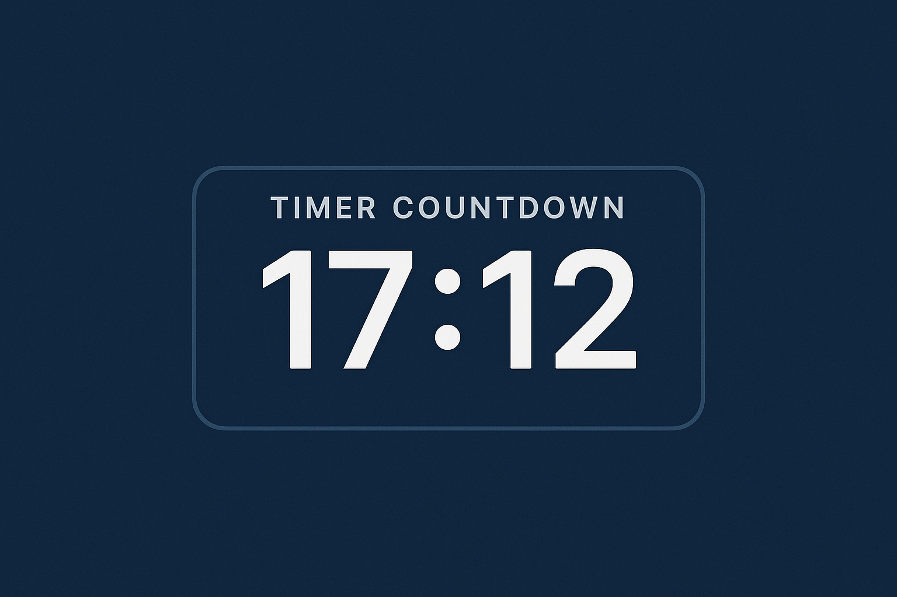

# Timer
Countdown Timer interface done using cursor (Vibe Coding)

A sleek, modern, and feature-rich countdown timer web application. Perfect for workouts, cooking, presentations, and any time-based activities.

[](timer-preview.jpg)

## Features

- 🕒 Customizable timer with hours, minutes, and seconds
- 🌓 Dark/Light mode with system theme detection
- 🎉 Celebration effects when timer completes
- 🎮 Keyboard shortcuts for quick control
- 📱 Responsive design for all devices
- 🖥️ Fullscreen mode support
- 🎵 Sound notification on completion
- 🔔 Browser notifications (with permission)
- 🎨 Modern and clean UI
- ⚡ Fast and lightweight

## Usage

1. Set your desired time using the input fields
2. Click "Start" or press Space to begin the countdown
3. Click "Pause" or press Space again to pause
4. Click "Reset" or press Escape to reset the timer
5. Use the fullscreen button (⛶) for a distraction-free experience
6. Toggle dark/light mode using the moon/sun icon

## Keyboard Shortcuts

- `Space`: Start/Pause timer
- `Escape`: Reset timer

## Installation

1. Clone the repository:
```bash
git clone https://github.com/ujjwalredd/Timer.git
```

2. Navigate to the project directory:
```bash
cd countdown-timer
```

3. Open `index.html` in your web browser

## Technologies Used

- HTML5
- CSS3
- JavaScript (ES6+)
- Font Awesome Icons
- Google Fonts (Inter)

## Browser Support

- Chrome (latest)
- Firefox (latest)
- Safari (latest)
- Edge (latest)
- Opera (latest)

## Contributing

Contributions are welcome! Please feel free to submit a Pull Request.

## Acknowledgments

- Font Awesome for the beautiful icons
- Google Fonts for the Inter font family
- All contributors who have helped improve this project

## Author

Ujjwal Reddy K S - [GitHub Profile](https://github.com/ujjwalredd)

## Support

If you find this project helpful, consider giving it a ⭐️ on GitHub! 
